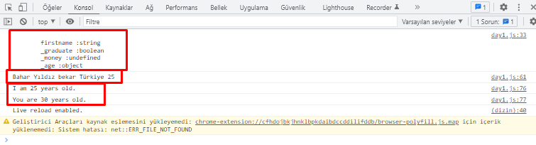

# 1. Gün Egzersizleri
----------------------
1."Yorumlar kodu okunabilir hale getirmeye yardımcı olur" yazan tek satırlı bir yorum yazın.

```js
// Yorumlar kodu okunabilir hale getirmeye yardımcı olur.
```

2."30GundeJavaScript eğitimine hoş geldiniz" yazan başka bir yorum satırı oluşturun.
```js
// 30 GundeJavaScript eğitimine hoş geldiniz
```

3."Yorumlar kodu okunabilir, yeniden kullanımı kolay ve bilgilendirici bir hale getirir." yazılı, birden çok satıra yayılmış çok satırlı bir yorum yazın.

```js
/*Yorumlar kodu okunabilir,

 yeniden kullanımı kolay ve
 
 bilgilendirici bir hale getirir.*/

```

4.Bir degisken.js isimli dosya oluşturun ve bu .js dosyasında string, boolean, undefined ve null veri türlerinde değişkenler oluşturun

```js
//değiken.js yerine day1.js dosyasında çalışmaya devam ettim.

let firstname = "Bahar"
let isGraduate = true
let isMerried 
let liveCity = null

```

5.Bir veriturleri.js isimli dosya oluşturun farklı veri türlerindeki verileri kontrol etmek için JavaScript typeof operatörünü kullanın.

```js
//veriturleri.js yerine day1.js dosyasında çalışmaya devam ettim.

let firstname = "Bahar",     //string
        _graduate = true ,   //boolean
        _money,              //undefined
        _age = null          //null 

console.log(`
        firstname :${typeof firstname} 
        _graduate :${typeof _graduate} 
        _money :${typeof _money}
        _age :${typeof _age}`) 

```

6.Herhangi bir değer ataması yapmadan dört adet değişken yazın

```js
    let name_
    let lastname_
    let age_
    let job_
   
```

7.Oluşturduğunuz değişkenlere değer ataması yapın

```js
    name_ = "bahar"
    lastname_ = "yıldız"
    age_ = 25
    job_ = "computer engineer" 

```

8.Adınızı, soyadınızı, medeni durumunuzu, ülkenizi ve yaşınızı birden çok satırda olacak şekilde saklamak için değişkenleri ve değerlerini oluşturun

````js
    let ad = "Bahar"
    let soyad = "Yıldız"
    let medeniDürümü = "bekar"
    let ülke = "Türkiye"
    let yas = 25
    
    console.log(ad ,soyad,medeniDürümü,ülke,yas)

````

9.Adınızı, soyadınızı, medeni durumunuzu, ülkenizi ve yaşınızı tek bir satırda olacak şekilde saklamak için değişkenleri ve değerlerini oluşturun

````js
    let ad_ = "Bahar" ,
        soyad_ = "Yıldız" ,
        medeniDürümü_ = "bekar" ,
        ülke_ = "Türkiye" ,
        yas_ = 25
        
````

10.benimYasim ve seninYasin adlı iki değişken oluşturun ve bunlara aşağıdaki değerleri atayın. Ardından bunları tarayıcının konsolunda çalıştırın

````js
    let myAge = 25
    let youAge = 30

    console.log(`I am ${myAge} years old.`)
    console.log(`You are ${youAge} years old.`)

````

