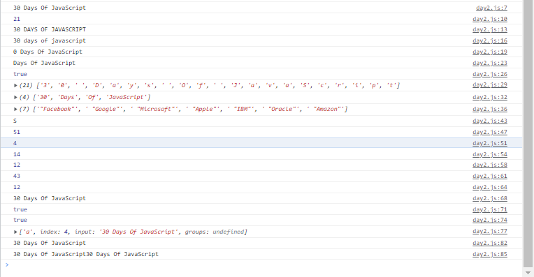

# 2. Gün Egzersizleri
--------------

### Exercise: Seviye 1

1. Challenge adında bir değişken tanımlayın ve  **'30 Days Of JavaScript'** başlangıç ​​değerine atayın.

````js
let challenge = "30 Days Of JavaScript"

````
2. __console.log()__ kullanarak tarayıcı konsolunda değişkeni yazdırın,

````js
console.log(challenge)

````
3. _console.log()_ kullanarak tarayıcı konsolunda dizenin __length__ değerini yazdırın,

````js
console.log(challenge.length)

````
4. __toUpperCase()__ yöntemini kullanarak tüm dize karakterlerini büyük harflerle değiştirin,

````js
console.log(challenge.toUpperCase())

````
5. __toLowerCase()__ yöntemini kullanarak tüm dize karakterlerini küçük harflerle değiştirin,

````js
console.log(challenge.toLowerCase())

````
6. __substr()__ veya __substring()__ yöntemini kullanarak string'in ilk kelimesini kesin-silin 
(dilimleyin)

````js
console.log(challenge.substring(1)) // nereye kadar kesmek istiyorsak ondan bir değer fazla yazmalıyız. 

````
7. *Days Of JavaScript* ifadesini *30 Days Of JavaScript*'ten ayırın.

````js
console.log(challenge.substring(3)) // diziler gibi saymaya sıfırdan (0) başaladığını unutmayınız.
````
8. __includes()__ yöntemini kullanarak string'in __Script__ kelimesini içerip içermediğini kontrol edin

````js
console.log(challenge.includes("Script"))

````
9. __split()__ yöntemini kullanarak __string__ öğesini bir __array__'ye bölün

````js
console.log(challenge.split(""))

````
10. 30 Days Of JavaScript dizesini __split()__ yöntemini kullanarak boşlukta bölün

````js
console.log(challenge.split(" "))

````
11. 'Facebook, Google, Microsoft, Apple, IBM, Oracle, Amazon' dizeyi virgülden __split__ ve bir dizi olarak değiştirin.

````js
let firma ='"Facebook", "Google", "Microsoft", "Apple", "IBM", "Oracle", "Amazon"'
 console.log(firma.split(","))

````
12. __replace()__ yöntemini kullanarak 30 Days of JavaScript'i 30 Days of Python olarak değiştirin.

````js
console.log(challenge.replace("JavaScript","Python")) 

````
13. '30 Days of JavaScript' dizesinde dizin 15'teki karakter nedir? __charAt()__ yöntemini kullanın.

````js
console.log(challenge.charAt(15))

````
14. __charCodeAt()__ kullanan '30 Days of JavaScript' dizesindeki J karakter kodu nedir?

````js
console.log(challenge.charCodeAt("J")) //ascıı degerini veriyor.

````
15. 30 Days of JavaScript'te __a__ öğesinin ilk oluşumunun konumunu belirlemek için __indexOf__ kullanın

````js
console.log(challenge.indexOf("a")) // baştan ilk a degerinin indexi buluyor.

````
16. 30 Days of JavaScript'te __a__ öğesinin son oluşumunun konumunu belirlemek için __lastIndexOf__ kullanın.

````js

````
17. Aşağıdaki cümlede __çünkü__ kelimesinin ilk geçtiği yeri bulmak için __indexOf__ kullanın:
__'Bir cümleyi çünkü ile bitiremezsiniz çünkü çünkü bir bağlaçtır'__

````js
let cümle = 'Bir cümleyi çünkü ile bitiremezsiniz çünkü çünkü bir bağlaçtır'
console.log(cümle.indexOf("çünkü"))// cümle içindeki aradığımız kelimenin ilk başladığı indexi buluyor.
````

18. Aşağıdaki cümlede __çünkü__ kelimesinin son geçtiği yeri bulmak için __lastIndexOf__ kullanın:
__'Bir cümleyi çünkü ile bitiremezsiniz çünkü çünkü bir bağlaçtır'__

````js
console.log(cümle.lastIndexOf("çünkü"))

````

19. Aşağıdaki cümlede __çünkü__ kelimesinin ilk geçtiği yeri bulmak için __search__ kullanın:
__'Bir cümleyi çünkü ile bitiremezsiniz çünkü çünkü bir bağlaçtır'__

````js
console.log(cümle.search("çünkü"))

````

20. Bir dizgenin başındaki ve sonundaki boşlukları kaldırmak için __trim()__ kullanın. Örneğin '30 Days Of JavaScript'.

````js
let string ="                  30 Days Of JavaScript                    "
console.log(string.trim())
````

21. *30 Days Of JavaScript* dizesiyle __startsWith()__ yöntemini kullanın ve sonucu doğru yapın

````js
console.log(challenge.startsWith("30"))

````
22. *30 Days Of JavaScript* dizesiyle __endsWith()__ yöntemini kullanın ve sonucu doğru yapın

````js
console.log(challenge.endsWith("JavaScript"))

````
23. JavaScript'in 30 Günü'ndeki tüm __a__'leri bulmak için __match()__ yöntemini kullanın

````js
console.log(challenge.match("a"))

````
24. __concat()__ kullanın ve '30 Days of' ve 'JavaScript'i tek bir dize olan '30 Days of JavaScript' ile birleştirin

````js
let str1= "30 Days Of"
let str2 = " JavaScript"
console.log(str1.concat(str2))

````
25. 30 Gün JavaScript'i 2 kez yazdırmak için __repeat()__ yöntemini kullanın

````js
console.log(challenge.repeat(2))

````


### Egzersiz: Seviye 2

1. console.log() kullanarak aşağıdaki ifadeyi yazdırın:

    ```sh
    The quote 'There is no exercise better for the heart than reaching down and lifting people up.' by John Holmes teaches us to help one another.
    ```

2. console.log()'u kullanarak Rahibe Teresa'nın aşağıdaki alıntısını yazdırın:

    ```sh
    "Love is not patronizing and charity isn't about pity, it is about love. Charity and love are the same -- with charity you give love, so don't just give money but reach out your hand instead."
    ```

3. '10' tipinin tam olarak 10'a eşit olup olmadığını kontrol edin. Değilse tam olarak eşit yapın.
4. parseFloat('9.8') 10'a tam olarak eşit değilse, 10'a eşit olup olmadığını kontrol edin.
5. Hem python hem de jargonda 'on' ifadesinin bulunup bulunmadığını kontrol edin
6. _Umarım bu kurs jargonla dolu değildir_. Cümlede _jargon_ olup olmadığını kontrol edin.
7. 0 ile 100 arasında rastgele bir sayı üretin.
8. 50 ile 100 arasında rastgele bir sayı üretin.
9. Dahil olmak üzere 0 ile 255 arasında rastgele bir sayı oluşturun.
10. Rastgele bir sayı kullanarak 'JavaScript' dize karakterlerine erişin.
11. Aşağıdaki kalıbı yazdırmak için console.log() ve kaçış karakterlerini kullanın.

    ```js
    1 1 1 1 1
    2 1 2 4 8
    3 1 3 9 27
    4 1 4 16 64
    5 1 5 25 125
    ```

12. __substr__ kullanarak __çünkü çünkü__ ifadesini aşağıdaki cümleden ayırın:__'Bir cümleyi çünkü ile bitiremezsiniz çünkü çünkü bir bağlaçtır'__

### Egzersiz: Seviye 3

1. 'Aşk bu dünyadaki en iyi şeydir. Bazıları aşkını buldu ve bazıları hala aşkını arıyor.' Bu cümledeki __love__ kelimesini sayın.
2. Aşağıdaki cümledeki tüm __çünkü__ sayısını saymak için __match()__ kullanın:__'Bir cümleyi çünkü ile bitiremezsiniz çünkü çünkü bir bağlaçtır'__
3. Aşağıdaki metni temizleyin ve en sık kullanılan kelimeyi bulun (ipucu, değiştirme ve normal ifadeleri kullanın).

    ```js
        const sentence = '%I $am@% a %tea@cher%, &and& I lo%#ve %te@a@ching%;. The@re $is no@th@ing; &as& mo@re rewarding as educa@ting &and& @emp%o@weri@ng peo@ple. ;I found tea@ching m%o@re interesting tha@n any ot#her %jo@bs. %Do@es thi%s mo@tiv#ate yo@u to be a tea@cher!? %Th#is 30#Days&OfJavaScript &is al@so $the $resu@lt of &love& of tea&ching'
    ```

4. Aşağıdaki metinden sayıları çıkararak kişinin yıllık toplam gelirini hesaplayın. 
'Aylık maaşından 5000 euro, yıllık 10000 euro ikramiye, ayda 15000 euro online kurstan kazanıyor.'
